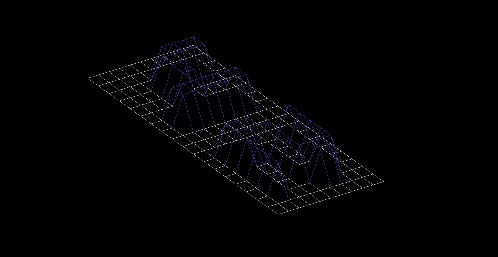
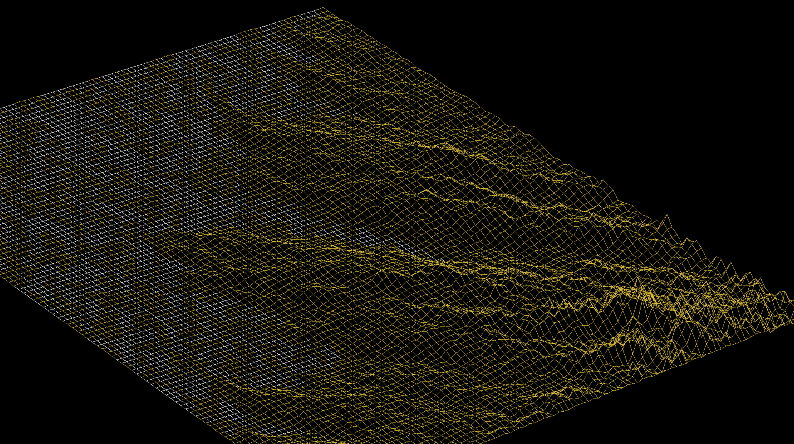

<h1 align="center">
	🧰 42 Project: FDF
</h1>

<p align="center">
	<b><i>FUNCTION TO GET LINE FROM FILE DESCRIPTOR</i></b><br>
</p>

<p align="center">
	
	
	
	
	
</p>

<h3 align="center">
	<a href="#objective">About</a>
	<span> · </span>
	<a href="#minilibx">Usage</a>
	<span> · </span>
	<a href="#bresenhams-line-algorithm">Algorithm</a>
  <span> · </span>
  <a href="#hex-colors">Hex Colors</a>
</h3>

## Objective
*In this project you will discover the basics of graphic programming, and in particular how to place points in space, how to join them with segments and most importantly how to observe the scene from a particular viewpoint.   You will also discover your first graphic library: miniLibX. This library was developedninternally and includes the minimum necessary to open a window, light a pixel and deal with events linked to this window: keyboard and mouse. This project also introduces you to “events” programming. Don’t forget to watch the e-learning videos!*

#### Skills
- Graphics
- Imperative programming
- Algorithms & AI
- Rigor

## MiniLibx
MiniLibx is an in house graphics library for students at 42 to cry and curse over.  The documentation is pretty limited, the provided library is out of date, but that is all part of the learning process.

The Minilibx library provided on the project page of 42, will not work on macOS Sierra or newer, but fortunately, you will find an updated one here.  This is also a treasure trove of information and I recommend you spend more time there than you do here.

The minimum code to get started with MiniLibx is the following:
```c
#include <mlx.h>
int main(void)
{
  void *mlx;
  void *window;
  
  mlx = mlx_init();
  window = mlx_new_window(mlx, 1000, 1000, "Title");
  
  mlx_loop(mlx);
  return (0);
}
```
And to compile the above code, you can use the following:
> gcc -Wall -Wextra -Werror -I minilibx -L minilibx -lmlx -framework OpenGL -framework AppKit main.c

# Bresenham's Line Algorithm
For fdf, we will be given a number of points to draw our wireframes from, but we will eventually need to draw lines between these points.  While algorithms such as Wu's algorithm are also frequently used in modern computer graphics (thanks to it's support of antialiasing), the speed and simplicity of Bresenham's line algorithm means that it is still important today. It is commonly used to draw line primitives in a bitmap image (e.g. on a computer screen), as it uses only integer addition, subtraction and bit shifting, all of which are very cheap operations in standard computer architectures. It is one of the earliest algorithms developed in the field of computer graphics and thanks to it's simplicity, it is often implemented in either the firmware or the graphics hardware of modern graphics cards.

Below is a C implementation of Bresenham's Line Algorithm.  Note that this will NOT pass the 42 Norminette, but making the changes should be simple enough!
```c
// Instead of swaps in the initialisation, use error 
// calculation for both directions x and y simultaneously 
void line(int x0, int y0, int x1, int y1) {
 
  int dx = abs(x1-x0), sx = x0<x1 ? 1 : -1;
  int dy = abs(y1-y0), sy = y0<y1 ? 1 : -1; 
  int err = (dx>dy ? dx : -dy)/2, e2;
 
  for(;;){
    setPixel(x0,y0);
    if (x0==x1 && y0==y1) break;
    e2 = err;
    if (e2 >-dx) { err -= dy; x0 += sx; }
    if (e2 < dy) { err += dx; y0 += sy; }
  }
}
```
References:  
- [Algorithm Examples](http://rosettacode.org/wiki/Bitmap/Bresenham%27s_line_algorithm)
- [Explanation](https://youtu.be/RGB-wlatStc)

## Hex Colors
The colors provided in some of the maps for fdf are in Hexadecimal.  The below link can provide a very quick and rudimentary understanding of how hex-colors work.

Reference:
- [Hex Colors](https://www.mathsisfun.com/hexadecimal-decimal-colors.html)
- [README](https://github.com/nilsonmolina/)

## Screenshots


